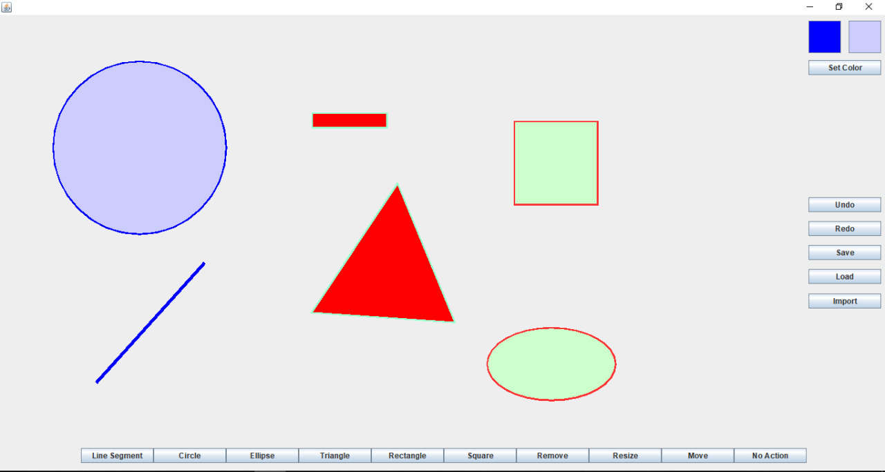
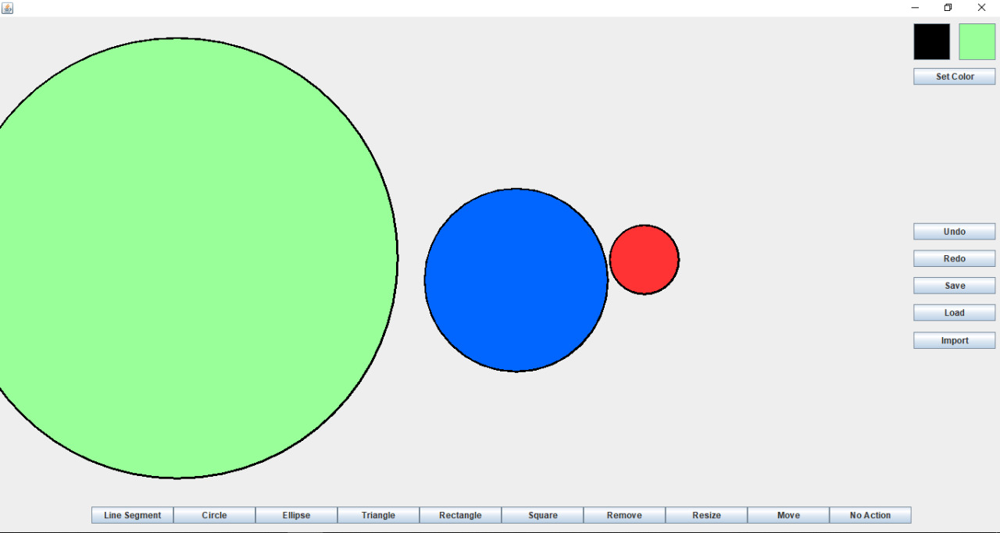
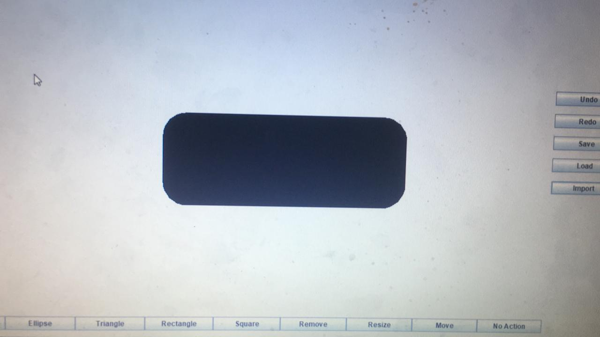
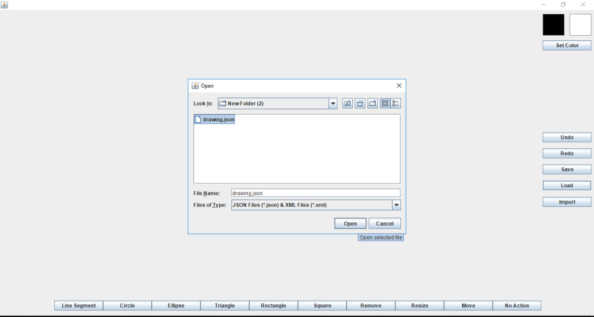
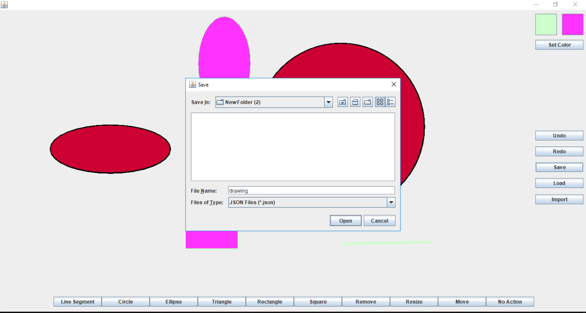

# Vector-Based-Drawing-Application
A GUI application using Java Swing and AWT for drawing geometric shapes with features such as:
- Coloring
- Resizing
- Moving
- Copying and pasting
- Saving and loading in XML and JSON formats
- The ability to add extensions at runtime
## Report contains
- UML diagram
- Design description
## Screenshots

> Shape added at runtime

> Loading from JSON file

> Saving to JSON file

